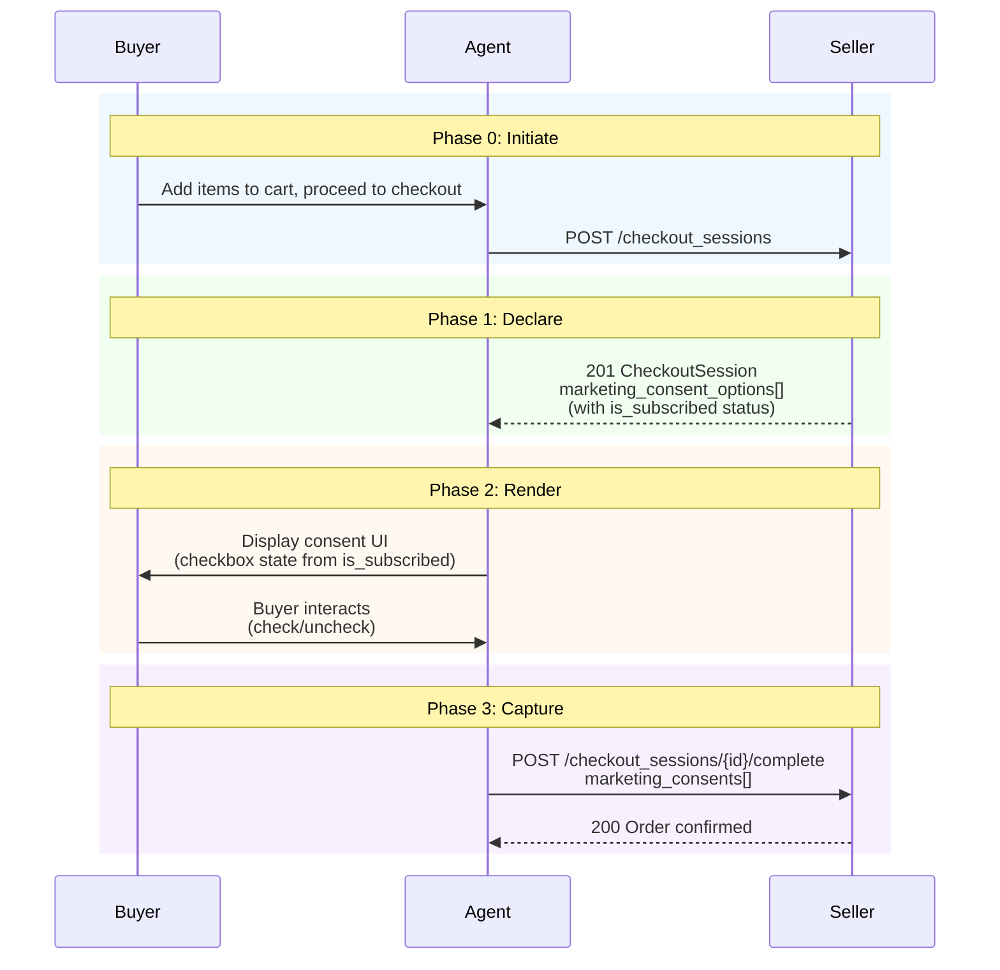

# RFC: Marketing Consent

**Status:** Proposal
**Version:** unreleased
**Scope:** Marketing opt-in consent capture during checkout

This RFC defines a marketing consent mechanism for the Agentic Commerce Protocol (ACP). Sellers declare available marketing opt-in channels on the checkout session response; agents render the consent UI and submit the buyer's decisions on the checkout complete request.

---

## 1. Motivation

Marketing opt-in is a standard feature on virtually every e-commerce checkout page. When buyers purchase through ACP-integrated agents instead of merchant storefronts, this opt-in opportunity is lost because the protocol has no mechanism to:

1. **Signal opt-in availability**: Sellers cannot tell agents they want to offer marketing consent.
2. **Communicate existing subscription status**: Sellers cannot tell agents that a returning buyer is already subscribed, so agents cannot pre-check the consent box or intelligently skip the prompt.
3. **Capture consent**: Agents cannot pass the buyer's opt-in decision to the seller.
4. **Display the prompt**: Agents have no display text or context to render a consent checkbox.

### Why the community should care

- **Merchants lose a key acquisition channel**: Marketing drives repeat purchases — without opt-in support, agentic checkout is less valuable than web checkout.
- **Buyers lose choice**: Buyers who want merchant updates have no way to opt in during agentic checkout.
- **Regulatory compliance**: GDPR, CAN-SPAM, and CCPA require explicit consent before marketing communications — the protocol should support capturing this at the right moment.
- **Merchant adoption**: If ACP cannot capture marketing consent, merchants have less incentive to support the protocol — it is a competitive disadvantage vs. their own checkout.

### Precedent

- **Shopify Checkout API**: Includes `buyer_accepts_marketing` boolean on checkout.
- **Stripe Checkout**: Supports `consent_collection.promotions` for marketing consent.
- **BigCommerce**: Offers newsletter subscription opt-in at checkout.
- **WooCommerce**: Plugins for marketing consent checkbox at checkout.

All major e-commerce platforms treat marketing consent as a core checkout feature, not an afterthought.

---

## 2. Goals and Non-Goals

### 2.1 Goals

1. **Seller-declared consent**: Sellers decide whether to offer marketing opt-in and which channels to include.
2. **Agent-rendered UI**: Agents control the consent UX — composing display text, choosing layout, and linking to privacy policies.
3. **Existing subscription awareness**: Sellers communicate whether the buyer is already subscribed, so agents render the correct default state.
4. **Consent at confirm time**: Consent is captured at checkout completion, not during address or shipping selection.
5. **Selective surfacing**: Agents MAY surface a subset of offered channels based on platform capabilities.

### 2.2 Non-Goals

- **Subscription management**: This RFC does not cover unsubscribe flows, preference centers, or subscription status queries outside checkout.
- **Consent storage**: The protocol captures consent at the transaction boundary. How sellers store and enforce consent is out of scope.
- **Content preview**: The protocol does not define what marketing content will be sent — only that the buyer consents to receive it.
- **Double opt-in flows**: Some jurisdictions require confirmation emails after initial opt-in. This is a seller-side concern, not a protocol concern.

---

## 3. Design

### 3.1 Three-Phase Architecture

Marketing consent flows through three phases:

| Phase | Actor | Action |
|-------|-------|--------|
| **Declare** | Seller | Includes `marketing_consent_options` on the `CheckoutSession` response with channel, display text, privacy policy URL, and existing subscription status. |
| **Render** | Agent | Displays consent UI based on the options. Sets checkbox default from `is_subscribed`. Links to privacy policy. |
| **Capture** | Agent → Seller | Includes `marketing_consents` on the `CheckoutSessionCompleteRequest` with the buyer's decision for each surfaced channel. |

### 3.2 Schemas

#### MarketingConsentOption (seller → agent)

Included in the `CheckoutSession` response to declare available marketing channels.

| Field | Type | Required | Description |
|-------|------|----------|-------------|
| `channel` | string | Yes | Marketing channel (open enum, e.g. `email`, `sms`, `whatsapp`). |
| `display_text` | string | Yes | What the buyer is consenting to receive. Agents MAY use this to compose their own consent prompt. |
| `privacy_policy_url` | string (URI) | Yes | URL to the seller's privacy policy. |
| `is_subscribed` | boolean | No | Whether the buyer is currently subscribed. Defaults to `false`. When `true`, agents SHOULD render the checkbox pre-checked. |

#### MarketingConsent (agent → seller)

Included in the `CheckoutSessionCompleteRequest` to submit the buyer's decisions.

| Field | Type | Required | Description |
|-------|------|----------|-------------|
| `channel` | string | Yes | Channel matching the consent option. |
| `opted_in` | boolean | Yes | Whether the buyer consented to marketing on this channel. |

### 3.3 Field Placement

- **`marketing_consent_options`**: Optional array on `CheckoutSessionBase`. Present when the seller offers marketing opt-in.
- **`marketing_consents`**: Optional array on `CheckoutSessionCompleteRequest`. Present when the agent surfaced consent options to the buyer.

### 3.4 Channel as Open Enum

The `channel` field uses an open enum pattern: `email` and `sms` are well-known values, but sellers MAY use any string (e.g., `whatsapp`, `push`, `messenger`). Agents SHOULD surface channels they recognize and omit unrecognized channels from the response. This avoids a breaking schema change when new channels are added.

### 3.5 Contact Resolution

Marketing consent applies to the buyer's contact information, resolved with the following precedence:

**For `email` consent:**
1. `buyer.email` (primary — required when `buyer` is present)
2. `fulfillment_details.email` (fallback)

**For `sms` or `whatsapp` consent:**
1. `buyer.phone_number` (primary — optional on `Buyer`)
2. `fulfillment_details.phone_number` (fallback)

If no contact can be resolved for a channel (e.g., email consent without either `buyer.email` or `fulfillment_details.email`), the seller MUST ignore the consent for that channel.

**Rationale**: The buyer is the person opting in to marketing, so their contact info is the natural target. The `fulfillment_details` fallback ensures coverage when the `buyer` object is not provided. This keeps marketing on the same channels the seller already uses for transactional communications.

### 3.6 Edge Cases

**Unsolicited consent entries:**
- If the agent sends a `marketing_consents` entry for a channel the seller did not offer in `marketing_consent_options`, the seller SHOULD ignore that entry.

**Non-interaction:**
- If the buyer does not interact with the consent UI, the agent SHOULD send `opted_in` matching the `is_subscribed` value, preserving the current state.

---

## 4. End-to-End Flow



### 4.1 Scenario Matrix

| # | Scenario | Seller Behavior | Agent Behavior |
|---|----------|-----------------|----------------|
| 1 | **New buyer** (no prior consent) | Sends option with `is_subscribed: false` (or omitted) | Renders unchecked checkbox. Buyer can opt in. |
| 2 | **Returning buyer** (already subscribed) | Sends option with `is_subscribed: true` | Renders pre-checked checkbox. Buyer can uncheck to revoke. |
| 3 | **Returning buyer** (seller omits option) | Omits `marketing_consent_options` entirely | Shows nothing. Existing subscription preserved server-side. |

---

## 5. HTTP Interface

Marketing consent uses existing checkout endpoints — no new endpoints are introduced.

### 5.1 CheckoutSession Response (seller → agent)

The `CheckoutSession` response gains an optional `marketing_consent_options` array:

```json
{
  "id": "checkout_session_123",
  "status": "ready_for_payment",
  "marketing_consent_options": [
    {
      "channel": "email",
      "display_text": "Promotional emails, product launches, and exclusive offers",
      "privacy_policy_url": "https://www.example.com/privacy",
      "is_subscribed": false
    },
    {
      "channel": "sms",
      "display_text": "Order updates and exclusive deals via text message",
      "privacy_policy_url": "https://www.example.com/privacy",
      "is_subscribed": false
    }
  ]
}
```

### 5.2 CheckoutSessionCompleteRequest (agent → seller)

The complete request gains an optional `marketing_consents` array:

```json
{
  "payment_data": {
    "type": "card",
    "token": "tok_abc123"
  },
  "marketing_consents": [
    { "channel": "email", "opted_in": true },
    { "channel": "sms", "opted_in": false }
  ]
}
```

---

## 6. Rationale

### Why at confirm time, not during checkout update?

- **Privacy**: The buyer's contact info should not be used for marketing before they commit to a purchase.
- **Regulatory alignment**: GDPR requires consent to be "freely given, specific, informed and unambiguous" — tying it to checkout completion ensures it accompanies an informed transaction.
- **UX**: Consent checkboxes naturally belong next to the "Place Order" button, not during address or shipping selection.
- **Schema separation**: `marketing_consents` is a standalone field on `CheckoutSessionCompleteRequest`, keeping consent separate from both `Buyer` (identity) and `FulfillmentDetails` (delivery logistics).

### Why a three-phase design?

- **Seller control**: Not all merchants want marketing opt-in — the seller decides whether to offer it.
- **Agent flexibility**: The agent controls the UI, composes its own display text, and presents the consent in the most appropriate way for its platform.
- **Existing status matters**: `is_subscribed` lets the seller communicate the buyer's current state, so the agent renders the right default.

### Why support multiple channels?

While email is the immediate need, commerce platforms commonly offer SMS and WhatsApp opt-in. Including these as an open enum from the start avoids a future schema change. Agents can ignore channels they do not support.

### Alternatives considered

1. **Pass consent during checkout update**: Premature — buyer has not committed. Creates privacy risk.
2. **Use `metadata` field**: Unstructured, non-standard, requires per-seller agent logic.
3. **Post-purchase opt-in**: Loses the high-conversion checkout moment and adds friction.
4. **Add consent to `Buyer` schema**: Conflates identity with transactional decisions. `Buyer` is sent on update requests, which would allow consent before purchase confirmation.
5. **Extension mechanism**: Marketing consent is fundamental enough (virtually every checkout has it) that it belongs in the core spec.

---

## 7. Security, Privacy, and Trust

- **Privacy improvement**: This proposal creates a standardized, explicit consent mechanism rather than relying on implicit or non-standard approaches.
- **Data minimization**: Consent is scoped to specific channels — sellers receive only the consent decisions the buyer explicitly makes.
- **No new data exposure**: The buyer's email and phone are already included in `buyer` or `fulfillment_details` — this proposal adds only a consent flag, not additional PII.
- **Regulatory support**: Provides a clear audit trail for GDPR, CAN-SPAM, and CCPA compliance — the `opted_in` boolean is an explicit record of consent.
- **Revocation path**: Returning buyers with `is_subscribed: true` can revoke consent by unchecking the box. Sellers who do not want to expose this risk should omit the channel.

---

## 8. Backward Compatibility

This is a purely additive change:

- **`marketing_consent_options`** is a new optional field on `CheckoutSessionBase` — existing implementations are unaffected.
- **`marketing_consents`** is a new optional field on `CheckoutSessionCompleteRequest` — existing complete calls continue to work.
- **No breaking changes**: Sellers that do not offer marketing consent omit `marketing_consent_options`. Agents that do not support it omit `marketing_consents`.
- **Graceful degradation**: If the agent does not send `marketing_consents`, the seller treats it as no consent given (current behavior).

---

## 9. Required Spec Updates

- [x] `spec/unreleased/json-schema/schema.agentic_checkout.json` — `MarketingConsentOption`, `MarketingConsent` schemas; `marketing_consent_options` on `CheckoutSessionBase`; `marketing_consents` on `CheckoutSessionCompleteRequest`
- [x] `spec/unreleased/openapi/openapi.agentic_checkout.yaml` — Matching OpenAPI definitions
- [x] `examples/unreleased/examples.agentic_checkout.json` — Multi-channel consent examples
- [x] `changelog/unreleased/marketing-consent.md` — Changelog entry
- [x] `rfcs/rfc.marketing_consent.md` — This document

---

## 10. Conformance Checklist

### Seller (MUST)

- [ ] MUST NOT treat omission of `marketing_consents` as new consent — preserve existing subscription state.
- [ ] MUST respect the buyer's `opted_in` value — MUST NOT send marketing to buyers who did not opt in.
- [ ] MUST ignore consent entries for channels not offered in `marketing_consent_options`.
- [ ] MUST ignore consent entries where no contact can be resolved for the channel.

### Seller (SHOULD)

- [ ] SHOULD omit `marketing_consent_options` for channels where the seller does not want to risk accidental revocation.

### Agent (MUST)

- [ ] MUST NOT surface marketing consent UI when `marketing_consent_options` is absent or empty.
- [ ] MUST NOT send `opted_in` values for consent options that were not displayed to the buyer — omit unsurfaced channels from `marketing_consents`.

### Agent (SHOULD)

- [ ] SHOULD render consent checkbox with default state based on `is_subscribed` (`true` = pre-checked, `false`/omitted = unchecked).
- [ ] SHOULD display the seller's `display_text` and link to `privacy_policy_url`.
- [ ] SHOULD include the buyer's decision in `marketing_consents` for each option surfaced.
- [ ] SHOULD send `opted_in` matching `is_subscribed` if the buyer does not interact with the consent UI (preserving current state).
